# Collaboration self paced learning

The aim of this section is to build some sites related to Collaboration. As part of the workshop, you can build what you want and feel inspired to be creative so these should be seen as a suggestion rather than a mandatory guide of what to build.

The insturctions listed below provide guidance on how to create the sites but additional materials are available in linked Microsoft Learn articles (eapecially as so much of this changes so quickly that we want to ensure younhave future info!).

## Scenario

You are setting up a new set of sites to improve your project governance, ensuring a new PMO function has the tools to understand what projects are happening and all employees have visibility of those projects.

#### Overview

You will focus on three key areas:

- PMO Site - main Project Management Office site that lists the projects and acts as the main repository for guidance
- Project Site - site created for each project
- Integration - connection to other systems

## PMO Site

#### Create PMO Site

- Head to main SharePoint Page - https://{your-tenant}.sharepoint.com/_layouts/15/sharepoint.aspx

- Create a communication site and call it PMO-{YOUR INITIALS}, choosing whichever template you like

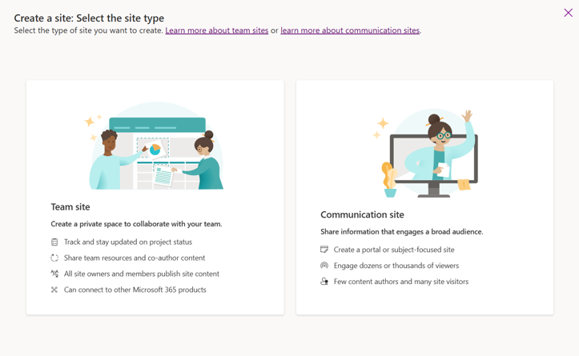

#### Create Project List

- On the home page, click on new and add a new List

- Select the blank list and call it projects

- Add some useful columns that must include SiteUrl and then can have others you see fit e.g. description, key initiative, project owner etc.

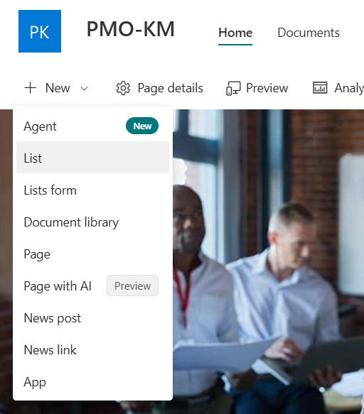
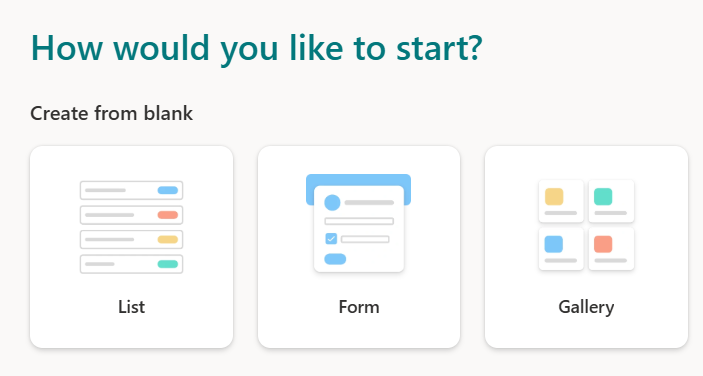

#### Create an automation

- Click on the Integrate menu and select Power Automate then Create a flow

Select Request approval in Teams (unless you want to be more inspired)

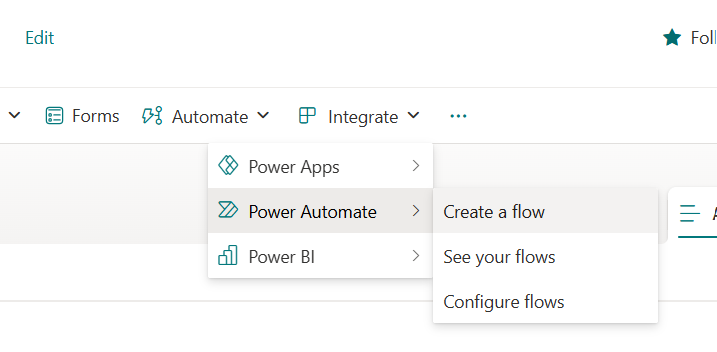
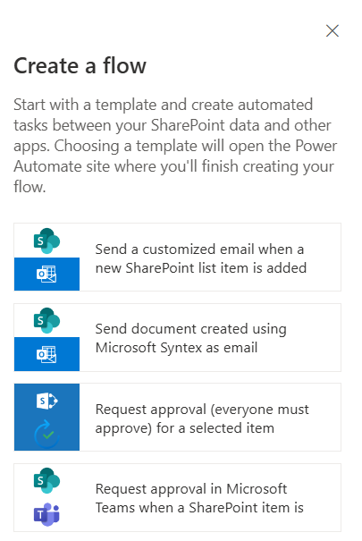

#### Set up the Flow

	- Configure the “Create an approval (V2)” action and the “Send an email” action

	- You will have to remove the optional fields in the approval action and potentially refresh the page.

 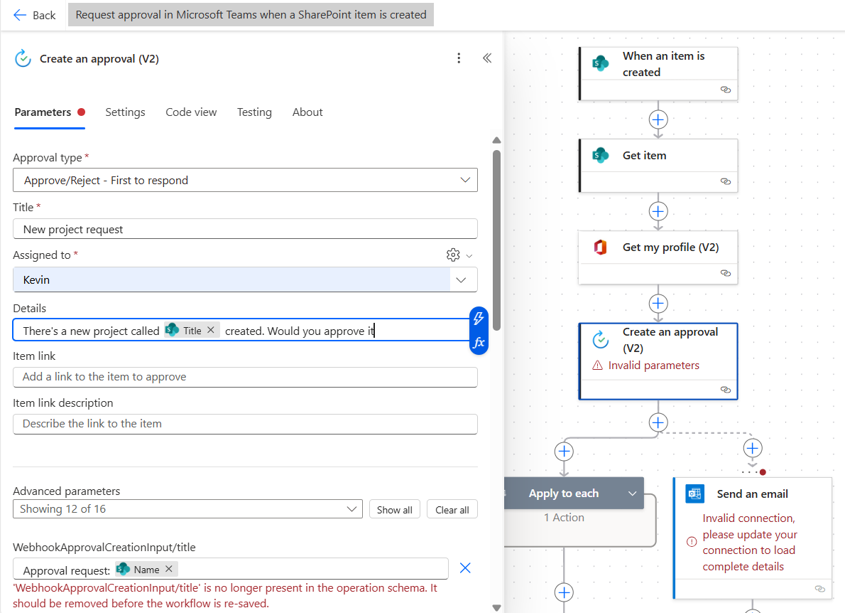

#### Add create site action

	- Add an action after the approval notification for “Send an HTTP request to SharePoint”

- Set the Site address to the root site

- Set the method to Post

- Set the Uri to _api/SPSiteManager/create

- Add the two advanced parameters

- Add the Headers
	
	- Accept: application/json;odata=none
	
	- Content-Type: application/json

-Add the Body:
	
	- {  "request": {    "Title": "@{triggerBody()?['Title']}",    "Url": "https://yourtenant.sharepoint.com/sites/@{triggerBody()?['SiteUrl']}",    "Lcid": 1033,    "ShareByEmailEnabled": false,    "Description": "Site for project collaboration",    "WebTemplate": "STS#3",    "Owner": "@{outputs('Get_my_profile_(V2)')?['body/mail']}"  }}

 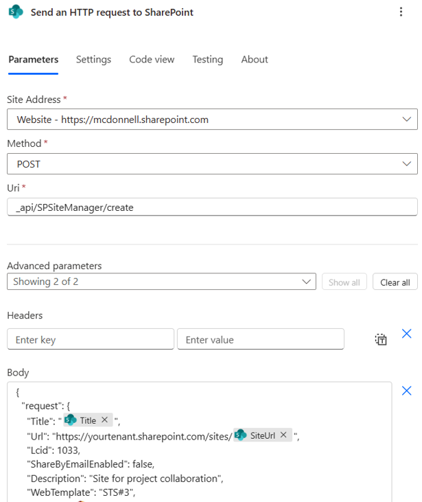

#### Create a Project Document

	- Ask Copilot to create a sample Project Document – do this from a blank document as some of the templates do not work well with Content Assembly

- Follow these steps to automate it with Content Assembly in the PMO Site
	
	- Create a modern template | Microsoft Learn

- Potentially set up a flow on creation to copy to Project Site

#### Create a Project Site

- Head to main SharePoint Page at https://{your-tenant}.sharepoint.com/_layouts/15/sharepoint.aspx

- Create a team site and call it whatever you like to match a project name, choosing the Project Site template

- Head to the Documents section

- Click on new and select Word document

- Now is your chance to get creative – use SharePoint to make a prompt for a type of project document
	
	• Requirements specification
	
	• Design document
	
	• Change document
	
	• Status Report

- Running out of time? We have some sample content to copy at XXXX

Example Prompt
Create a project design document for the project scoped below:
The Enterprise Digital Transformation Initiative (EDTI) aims to modernize and streamline our organization's operations by leveraging advanced digital technologies. This project will enhance efficiency, improve customer experience, and drive innovation across all departments. 

Scope 

Cloud Migration: Transitioning critical applications and data to cloud-based platforms to improve scalability, accessibility, and cost-efficiency. 

ERP System Upgrade: Upgrading our Enterprise Resource Planning system to integrate new functionalities and support better decision-making processes. 

CRM Enhancement: Enhancing our Customer Relationship Management system to provide a more personalized customer experience and improve customer retention. 

Data Analytics and Business Intelligence: Implementing advanced data analytics and business intelligence tools to gain insights and drive data-driven strategies. 

Cybersecurity Enhancement: Strengthening our cybersecurity measures to protect sensitive data and ensure compliance with industry standards. 

Digital Workplace Transformation: Creating a modern digital workplace that fosters collaboration, productivity, and employee satisfaction. . 

##### Add knowledge agent

- From the Documents library, click on the SharePoint icon on the bottom right and select “Organize this library”

- Note that if you have used folders, you will need to create a view with no folders

- Select Classify documents (or feel creative if you want to use other or your own prompts)

- See further details at Organize files in a SharePoint document library - SharePoint in Microsoft 365 | Microsoft Learn

 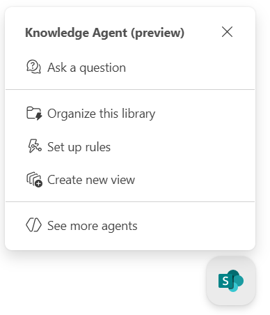

##### Show other agents

- Click on the agents icon on the top right

	- Explore the available agents there

- Add an icon to the home page using the Agent Link web part

 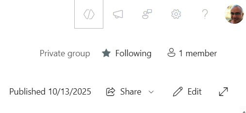
 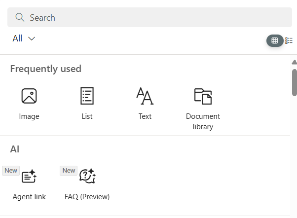

##### Show other agents

- Head to https://copilotstudio.Microsoft.com, click on create and select the Weather agent template

- Scroll down to Connect your data and click on Set up connection

- Create the agent and then select channels and set up the SharePoint channel for one of your project sites

 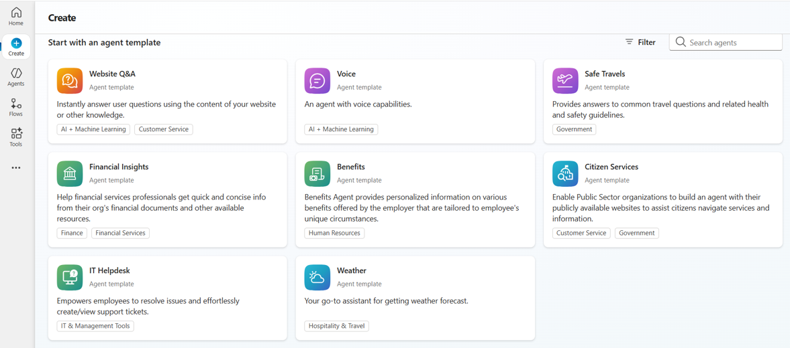
 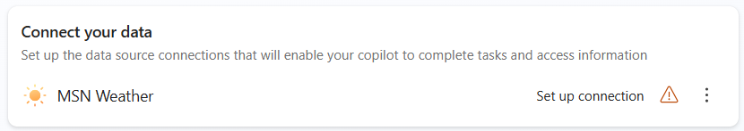

 ## Over to you!

Now it is time for you to play, sorry, we mean experiment! Try things out, work out which of these areas are important to you and ask us questions.

