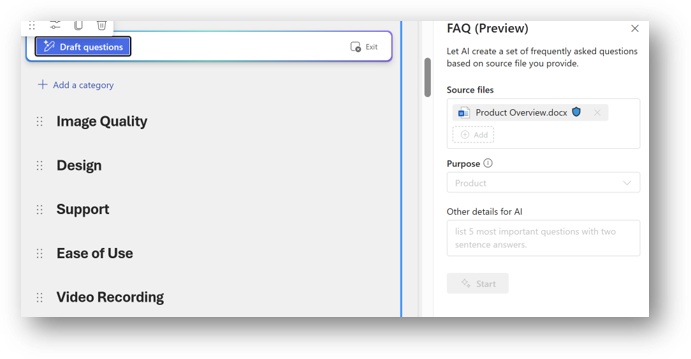

# Communication self paced learning

The aim of this section is to build some pages to help with Communication. As part of the workshop, you can build what you want and feel inspired to be creative so these should be seen as a suggestion rather than a mandatory guide of what to build.

The insturctions listed below provide guidance on how to create the pages but additional materials are available in linked Microsoft Learn articles (eapecially as so much of this changes so quickly that we want to ensure you have future info!).

## Scenario

You need to share some news to your team, department, location or across your organisation. You are tired, bored and just want to get it over with. Use Copilot to help generate some great news and inspire yourself a bit more.

## Creating pages

#### Create page with AI

- *Creating a page* - Select the +New button in the command bar of your SharePoint site and select Page with AI.
- *Select a template* - Choose a template that suits your needs. You will find a variety of templates like newsletter, event, status update, and process.
- *Use prompts to customise your page* - Once you select a template, you have the option to fill in keywords in the prompts that come with the template (Additionally, you can provide your own files as sources of the page for better results.)
- *Preview your page* - Preview your page to ensure everything looks good. Make any necessary adjustments to the content or layout.
- *Publish* - Once satisfied, save and publish your page.

#### Create section with AI

- Section with AI looks at the context of your page to offer prompt suggestions for what content you need next as a starting point.
- You either select one of those starting points or write your own and optionally ground in relevant files to give the AI more context.
- After you select Generate, Sections with AI then leverages your sources, the knowledge and content already inside of your organisation, and the content already on your page to create rich sections that go beyond just image and text. This could mean including information from meeting transcripts, recent documents, or any other knowledge AI has access to. Toggle between options in the header and choose your favourite!
- If the output section isn't quite right, you can then use AI refinement to make changes to both the content and layout of your section.
- Some examples include Change the background image, Add David Gower’s contact information, or Make the text more professional.
- If you need different suggestions, select Regenerate and you will get more options.
- After you have a section, select Add to page to add it to your canvas, and edit it as you would any other section.

#### Sections with AI – refining content

- Adjust text or tone to your requirements
- Change formatting of text fonts as an example
- Reference additional files if necessary

#### Page - web parts

Create a new page.
Select toolbox, and add a FAQ (Preview) web part.
Select Source Files: Files & Meetings
Choose Purpose: Event, Product, Policy, General
Other details for AI: Enter “create a FAQ for products and camera specifications”
Work through draft questions, answers that are generated by AI (see next slide).
Select “Keep It” to save the changes of FAQ web part.
Publish the page

#### Page – FAQ (Preview) Web Part

#### Adding Text Web Part 

Select Draft with AI icon
Adjust text or tone to your requirements
Change formatting of text fonts as an example
Reference additional files if necessary

