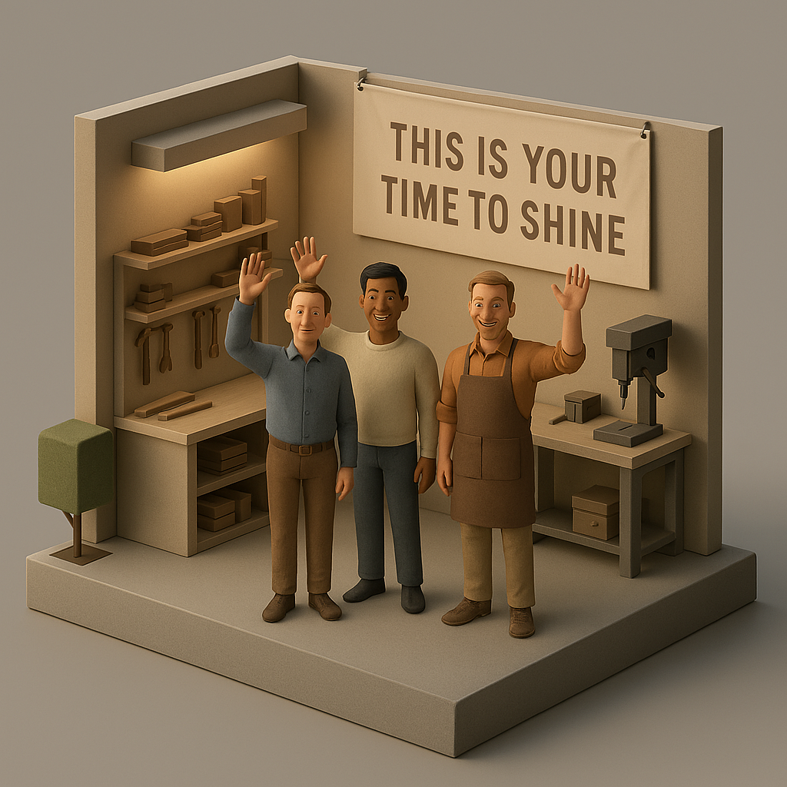

# South Coast Summit 2025 - SharePoint Content AI and agents workshop

This site is to support the South Coast Summit workshop on SharePoint Content AI and Agents. You can find the full slides in the resources.

While Chirag, Leon and Kevin will cover overviews and demos, the real magic will come from you as workshop attendees bringing your creativity through and we want to see what you can build.

You can take any of the routes below or a combination of all three. We will be floating around the room to help you as best we can.

You can follow the exact steps in each of these pages or go entirely up to you, we want to give you that freedom to work at the pace and style that suits your best. The power of this time is to have a brains trust of other people around you and the time to focus on experimentation in an open environment. So use that wisely!

- [Collaboration](collaboration.md)

